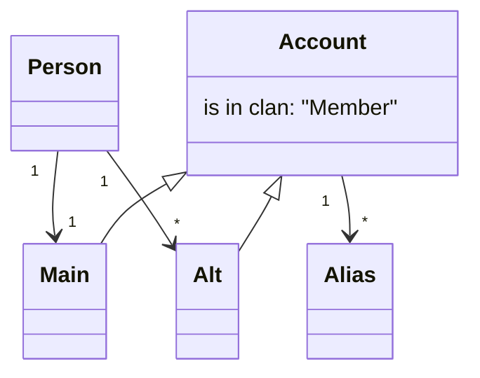

# Terminology
* Person: An actual person. A person can have multiple accounts.
* Account: A single account in the game, identified by the tag e.g. #2QLGU8XY. An account may not be in the clan.
* Member: An account that is in the clan.

* Alias: Shorthand for specifying an account. An account can have multiple aliases, but an alias can only belong to one account. Aliases are case-insensitive.
* Main: The main account of a Person. A person will have exactly 1 Main.
* Alt: An alternative account of a Person. A person can have multiple alts.

